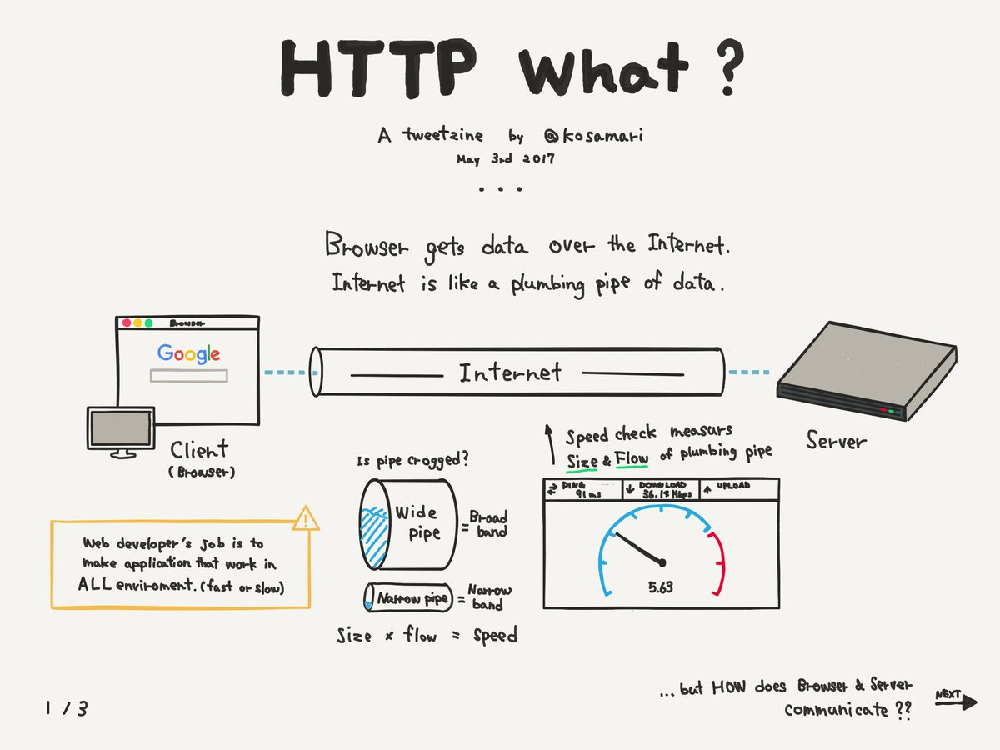
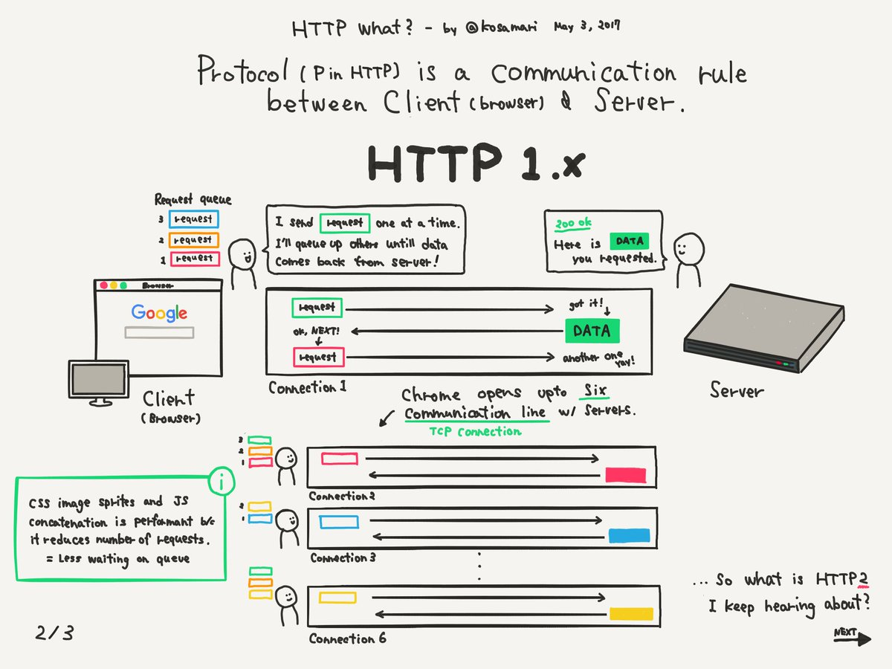
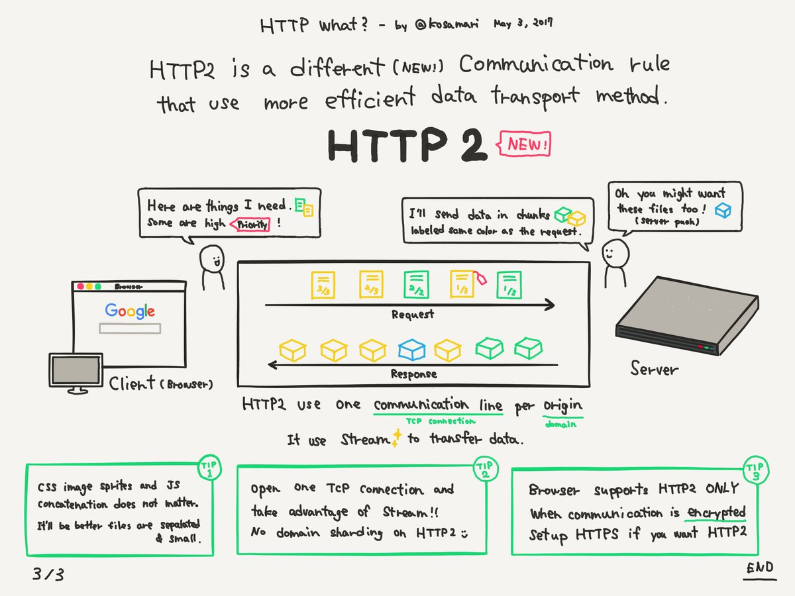

# Máster en Programación FullStack con JavaScript y Node.js
### JS, Node.js, Frontend, Backend, Firebase, Express, Patrones, HTML5_APIs, Asincronía, Websockets, Testing

## Clase 18

### HTTP2





**Recursos**
- [Wikipedia | HTTP/2](https://es.wikipedia.org/wiki/HTTP/2)
- [Introducción a HTTP/2](https://developers.google.com/web/fundamentals/performance/http2/?hl=es)
- [¿Qué es HTTP/2 y que ventajas tiene sobre HTTP 1.1?](https://somostechies.com/que-es-http2/#.W6uXIxMzZR4)
- [HTTP/2: así va a mejorar la velocidad de tu navegación sin que tú tengas que hacer nada](https://www.xataka.com/servicios/http-2-asi-va-a-mejorar-la-velocidad-de-tu-navegacion-sin-que-tu-tengas-que-hacer-nada)
- [HTTP/2 nuevo protocolo y cómo afecta al SEO](https://laculturadelmarketing.com/http2-y-como-afecta-al-seo/)
- [HTTP2, el nuevo Fast & Furious del protocolo](https://www.paradigmadigital.com/dev/http2-nuevo-fast-furious-del-protocolo/)


### Fetch, una alternativa a XMLHttpRequest
- [Compatibilidad nula con IE11](https://caniuse.com/#search=fetch)
- Se hace uso de [promesas](https://developer.mozilla.org/es/docs/Web/JavaScript/Guide/Usar_promesas) y se puede escalar con [Async/Await](https://developer.mozilla.org/es/docs/Web/JavaScript/Referencia/Sentencias/funcion_asincrona)
- Puede gestionar llamadas sin soporte a CORS
- Las peticiones no pueden ser paradas


**GET básico**
```javascript
function ajaxHandler (url, cb){
  fetch(url)
    .then(function(response) {
      return response.json();
    })
    .then(function(data) {
      cb(data)  
    })
    .catch(function(error) {
      console.log(error)
    });  
}

ajaxHandler("http://airemad.com/api/v1/station", function(data){
    console.log("Data:", data)
})
```

**Multimedia**
```javascript
var myImage = document.querySelector('.my-image');
fetch('flowers.jpg').then(function(response) {
  return response.blob();
}).then(function(blob) {
  var objectURL = URL.createObjectURL(blob);
  myImage.src = objectURL;
});
```

**La mágia es `Request`**

```javascript
var request = new Request('http://fictizia.com/subir', {
	method: 'POST', 
	mode: 'no-cors', 
	redirect: 'follow',
	headers: new Headers({
		'Content-Type': 'text/plain',
		'X-My-Custom-Header': 'CustomValue'
	})
});

fetch(request).then(function() { //Gestión de la respuesta });
```

**Subir los datos de un formulario**
```javascript
fetch('https://davidwalsh.name/submit', {
	method: 'post',
	body: new FormData(document.getElementById('comment-form'))
});

```


**Documentacion**
- [Response()](https://developer.mozilla.org/en-US/docs/Web/API/Response/Response)
- [Response.redirected](https://developer.mozilla.org/en-US/docs/Web/API/Response/redirected)
- [Response.clone()](https://developer.mozilla.org/en-US/docs/Web/API/Response/clone)
- [Response.status](https://developer.mozilla.org/en-US/docs/Web/API/Response/status)
- [Response.statusText](https://developer.mozilla.org/en-US/docs/Web/API/Response/statusText)
- [Response.type](https://developer.mozilla.org/en-US/docs/Web/API/Response/type)
- [Response.headers](https://developer.mozilla.org/en-US/docs/Web/API/Response/headers)
- [Body.bodyUsed](https://developer.mozilla.org/en-US/docs/Web/API/Body/bodyUsed)
- [Body.body](https://developer.mozilla.org/en-US/docs/Web/API/Body/body)
- [Body.text()](https://developer.mozilla.org/en-US/docs/Web/API/Body/text)
- [Body.json()](https://developer.mozilla.org/en-US/docs/Web/API/Body/json)
- [Body.formData()](https://developer.mozilla.org/en-US/docs/Web/API/Body/formData)
- [Body.blob()](https://developer.mozilla.org/en-US/docs/Web/API/Body/blob)
- [Body.arrayBuffer()](https://developer.mozilla.org/en-US/docs/Web/API/Body/arrayBuffer)
- [Response.ok](https://developer.mozilla.org/en-US/docs/Web/API/Response/ok)
- [Response.error()](https://developer.mozilla.org/en-US/docs/Web/API/Response/error)

**Recursos**
- [Fetch API by DWB](https://davidwalsh.name/fetch)
- [Introduction to fetch() By Matt Gaunt](https://developers.google.com/web/updates/2015/03/introduction-to-fetch)
- [This API is so Fetching! by Mozilla Hacks](https://hacks.mozilla.org/2015/03/this-api-is-so-fetching/)
- [That's so fetch! by Jake Archibald](https://jakearchibald.com/2015/thats-so-fetch/)
- [Can I use? Fetch](http://caniuse.com/#search=fetch)
- [Basics: Using AJAX with Fetch API](https://medium.com/letsboot/basics-using-ajax-with-fetch-api-b2218b0b9691)
- [Fetch: Polyfill](https://github.com/github/fetch)

### Ejercicios

**1 -** Refactorizaremos el ejercicio anterior para ofrecer al cliente un dashboard con la listas disponibles en *[Books API](http://developer.nytimes.com/docs/books_api/)*.
**Especificaciones:**
- Debes incluir una animación mientras esperamos la carga del contenido.
- Al cargar la web deben de aparecer todas las listas con los siguientes datos:
	- Nombre completo de la lista
	- La fecha del libro más antiguo en la lista
	- La fecha del libro ultimo incorporado
	- La frecuencia de actualización
	- Un link para poder cargar la lista.
- Al pinchar en el link de una lista especifica el DOM debe cambiar e incluir los siguientes datos:
- Un bontón para *volver atras* y recargar la disposición anterior
- Los libros deben estar organizados según el orden de la lista oficial
- Debes incluir la carátula del libro
- Debes incluir la cantidad de semanas que lleva en la lista
- Debes incluir la descripción
- Debes incluir el titulo y la posición que ocupa en la lista ( #1 titulo.... #2 titulo....)
- Debes incluir el link para poder comprar el libro en amazon (debe abrirse en otra pestaña)


**Concepto:**
- Dashboard:


- Dentro de una lista:


```javascript
    // Tu solución
```
