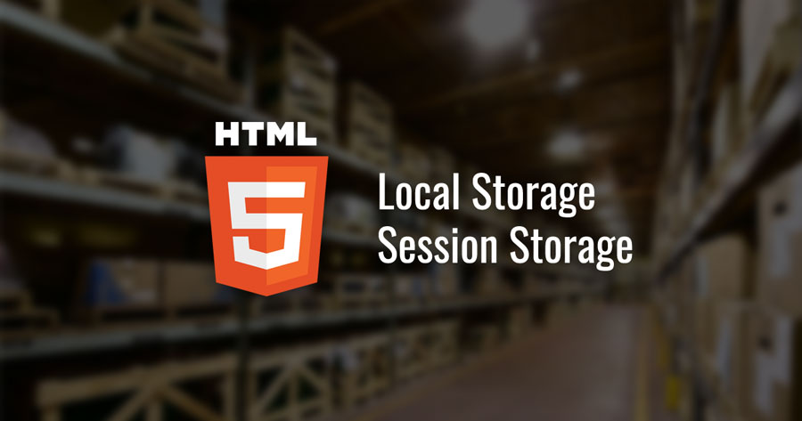
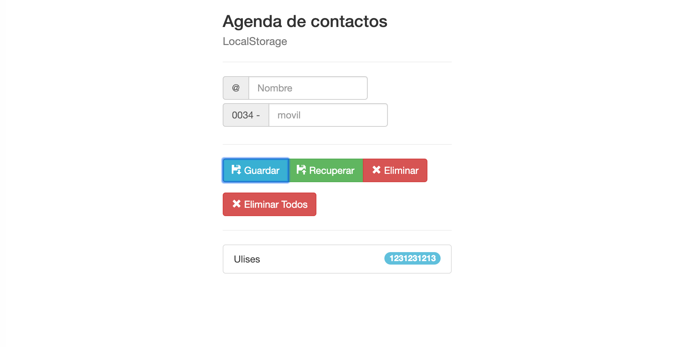
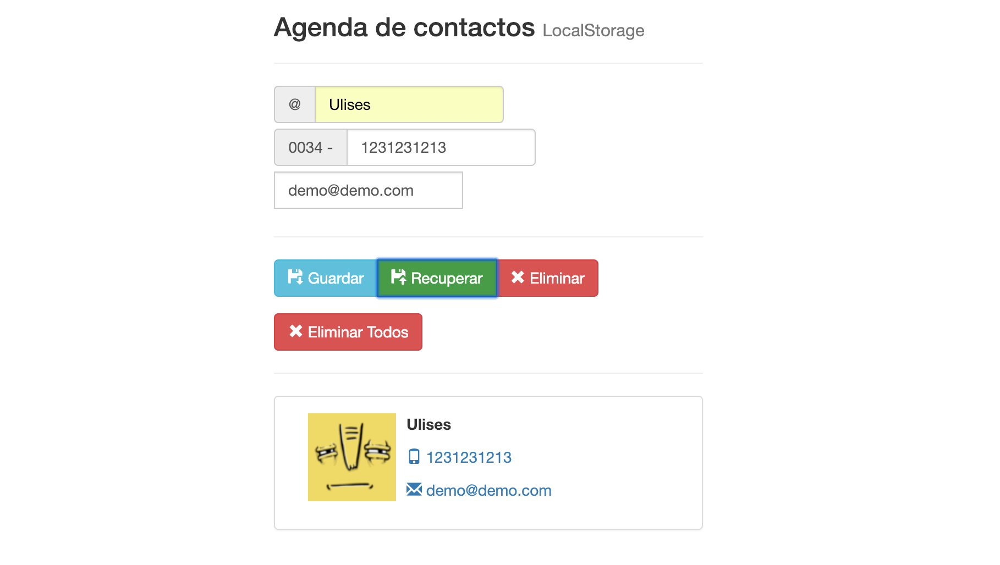

# Máster en Programación FullStack con JavaScript y Node.js
### JS, Node.js, Frontend, Backend, Firebase, Express, Patrones, HTML5_APIs, Asincronía, Websockets, Testing

## Clase 38



### LocalStorage

- [Soporte en Navegadores](http://caniuse.com/#search=localstorage)
- Convencional:
    - Cookies:
    - Espacio limitado (4kb)
    - Máximo 20 cookies
    - Por cada petición HTTP se envia y recibe todo el contenido (lectura servidor)
    - Caducidad
- Tipos:
    - SessionStorage (Solo se almacenan los datos durante la sesión)
    - LocalStorage (Almacenamiento persistente)
    - GlobalStorage (Firefox experimental - No usar)
- Uso y limitaciones:
    - 5-10Mb según navegador
    - Almacenamiento local (lectura/escritura cliente)
    - Sin caducidad
    - Funcionamiento clave/valor
    - Solo se permite el almacenamiento de cadenas de texto.

### LocalStorage: Problemas Conocidos:
- IE 8 y 9 almacena los datos basandose unicamente en el hostname, ignorando el protocolo (http/https) y el puerto.
- En iOS 5 y 6 los datos se almacenan en una localización que puede ser borrada ocasionalmente por el SO.
- Usando el modo "navegación privada" Safari, Safari para IOs y Navegadores Android no soportan sessionStorage o localStorage.
- En IE al acceder a LocalStorage desde local, el objeto localStorage pasa a ser undefined.
- Internet Explorer no soporta el almacenamiento de casi ninguna cadena de carácteres ASCII con una logitud menor a 20.
- En IE el evento "storage" genera errores:
    - IE10 : Se dispara el evento al usar iframes.
    - IE11 : Se confunden el valor antiguo con el nuevo valor (actualizado).
- IE10 en Windows 8 puede presentar el siguiente mensaje de error  "SCRIPT5: Access is denied" if "integrity" settings are not set correctly.
- Chrome en Local no funciona correctamente


### LocalStorage: Métodos y propiedades

**setItem()** Guardando datos
```javascript
    localStorage.setItem('clave', 'valor');
```

**getItem()** Recuperar un valor
```javascript
    console.info(localStorage.getItem('clave'));
```

**length** Total de elementos
```javascript
    console.info(localStorage.length);
```

**removeItem()** Eliminar un elemento
```javascript
    localStorage.removeItem('clave');
```

**clear()** Eliminar todo
```javascript
    localStorage.clear();
```

**Comprobación**
```javascript
if (window.localStorage) {
    console.info("La función Html5 localStorage está soportada");
} else {
    console.warn('Su navegador no soporta localStorage');
}

if (window.sessionStorage) {
    console.info('La función Html5 sessionStorage está soportada');
} else {
    console.warn('Su navegador no soporta sessionStorage');
}
```

**Usando json en LocalStorage**
```javascript
var objeto = {
    numero: 1,
    booleano : true,
    array: ["dato", true, 2],
    cadena: "dato"
    };
localStorage.setItem('clave', JSON.stringify(objeto));
var objetoRecuperado = JSON.parse(localStorage.getItem('clave'));
console.log(objetoRecuperado.booleano);    
```

**Eventos asociados**
- key: es la clave que se modifica
- oldValue: es el valor anterior de la clave que se modifica
- newValue: es el nuevo valor de la clave que se modifica
- url: la página donde se modifica la clave
- storageArea: el objeto donde se modifica la clave
- [Usa dos Pestañas](http://stackoverflow.com/questions/3055013/html5-js-storage-event-handler)
```javascript
window.addEventListener('storage', function(event){
    console.info("Se registran cambios en "+event.key+". El valor pasó de ser "+event.oldValue+" a "+event.newValue+".\nRecuerda que estas en "+event.url+" y usando el almacenamiento ", event.storageArea);
});
```

**Trucos**

Sacar todas las claves guardadas
```javascript
for (var key in localStorage){
   console.log(key)
}
```

Sacar todos los valores
```javascript
for ( var i = 0; i < localStorage.length; i++ ) {
  console.log( localStorage.getItem( localStorage.key( i ) ) );
}
```


### ContentEditable

- [Soporte en Navegadores](http://caniuse.com/#search=ContentEditable)
- Convencional:
    - Campos de texto
    - Formularios
- Recursos:
    - [Medium | contenteditable](https://medium.com/search?q=contenteditable)
    - [ContentEditable — The Good, the Bad and the Ugly](https://medium.com/content-uneditable/contenteditable-the-good-the-bad-and-the-ugly-261a38555e9c)
    - [CKEditor 5: The Future of Rich Text Editing](https://medium.com/content-uneditable/ckeditor-5-the-future-of-rich-text-editing-2b9300f9df2c)
    - [Fixing ContentEditable](https://medium.com/content-uneditable/fixing-contenteditable-1a9a5073c35d)
    - [A Standard for Rich-Text Data](https://medium.com/content-uneditable/a-standard-for-rich-text-data-4b3a507af552)
    - [Comparison with Other Rich Text Editors](https://quilljs.com/guides/comparison-with-other-rich-text-editors/)
    - [JefMari/awesome-wysiwyg](https://github.com/JefMari/awesome-wysiwyg)
- [execCommand](https://developer.mozilla.org/es/docs/Web/API/Document/execCommand)
    - [Demo](http://www-archive.mozilla.org/editor/midasdemo/)
    - [Código](https://developer.mozilla.org/en-US/docs/Rich-Text_Editing_in_Mozilla)


**Atributo `contentEditable`**
```html
<!-- estilos: [contenteditable] y [contenteditable]:hover -->
<!DOCTYPE html>
<html>
  <body>
    <div contentEditable="true">
      Modificame... tanto como quieras!
    </div>
  </body>
</html>
```

**designMode (editando todo el documento)**
```javascript
window.document.designMode = "on"; // off, por defecto
```


**spellcheck (editando todo el documento)**
```html
<!DOCTYPE html>
<html>
  <body>
    <div contentEditable="true" spellcheck="true">
      Modificame... tanto como quieras!
    </div>
  </body>
</html
```


### Ejercicios    

**1 -** Crear una libreta de contactos para guardar nombre y numero de telefono usando LocalStorage



- Objetivos:
    - Guardar Nombre y telefono
    - Mostrar todos los contactos en el html
    - Botón para borrar un contacto específico
    - Botón para borrar todos los contactos
    - Botón para recuperar el telefono de un contacto

[Solución](http://codepen.io/ulisesgascon/pen/LWWeJY)


**2 -** Crea una libreta de contactos para guardar multiples datos.



- Objetivos:
    - Guardar Nombre, telefono y email
    - Mostrar todos los contactos en el html
    - Botón para borrar un contacto específico
    - Botón para borrar todos los contactos
    - Botón para recuperar el telefono y email de un contacto
- Consejos:
    - Utiliza *JSON.parse()* y *JSON.stringify()* para guardar multiples datos bajo una misma clave
    - Genera un avatar al azar para el usuario usando [Adorable Avatars](http://avatars.adorable.io/)

[Solución](http://codepen.io/ulisesgascon/pen/mWWpQr)