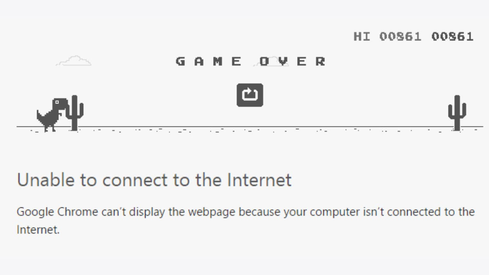

# Máster en Programación FullStack con JavaScript y Node.js
### JS, Node.js, Frontend, Backend, Firebase, Express, Patrones, HTML5_APIs, Asincronía, Websockets, Testing

## Clase 40




### Offline
[Soporte en Navegadores](http://caniuse.com/#search=offline%20web%20app)

**Recursos**
- [HTML5 Rocks! | Offline](https://www.html5rocks.com/es/features/offline)
- [MDN | Eventos online y offline](https://developer.mozilla.org/es/docs/Web/API/NavigatorOnLine/Eventos_online_y_offline)
- [HTML5 Rocks! | "Offline": What does it mean and why should I care?](https://www.html5rocks.com/en/tutorials/offline/whats-offline/)
- [Trabaja offline gracias a la API de caché de HTML5](https://www.genbeta.com/desarrollo/trabaja-offline-gracias-a-la-api-de-cache-de-html5)
- [MDN | Usar el caché de aplicaciones](https://developer.mozilla.org/es/docs/Web/HTML/Recursos_offline_en_firefox)
- [Ebook | Pro HTML5 Programming | Chapter 12: Creating HTML5 Offline Web Applications](http://apress.jensimmons.com/v5/pro-html5-programming/ch12.html)
- [HTML5 Docter | let’s take this offline](http://diveinto.html5doctor.com/offline.html)
- [W3C Spec | Offline](https://www.w3.org/TR/2011/WD-html5-20110525/offline.html)
- [TheFox/html5-offline-example](https://github.com/TheFox/html5-offline-example)
- [Tutorial: How to make an offline HTML5 web app, FT style](https://labs.ft.com/2012/08/basic-offline-html5-web-app/)
- [How To Use HTML5 Offline Storage In Your Website](https://www.hongkiat.com/blog/html5-offline-storage/)
- [Offline-capable applications with HTML5](http://www.linux-magazine.com/Online/Features/HTML5-Offline)
- [Offline Application: using manifest](https://html5demos.com/offlineapp/)
- [Researching HTML5 Offline](https://spin.atomicobject.com/2010/08/16/researching-html5-offline/)


**Uso y limitaciones**
- Aplicación disponible independientemente del estado de la conexión
- Se acelera la carga de los archivos
- Disminuyen las consultas al servidor
- En algunos navegadores es necesario que el usuario permita el almacenamiento
- Para incluir cambios en la aplicación es necesario modificar el manifiesto


### Offline: Comprobación
```javascript
if (!window.applicationCache) {
    console.warn("No se puede utilizar applicationCache :-(");
} else {
    console.log("Podemos utilizar applicationCache :-)");
}
```

### Offline: Verificando la conexión
```javascript
if (window.navigator.onLine) {
    const detalles = `<h1>Estas Conectado a Internet!!</h1>
    <h3>Detalles del navegador:</h3>
    <p>CodeName: ${navigator.appCodeName}</p>
    <p>Nombre: ${navigator.appName}</p>
    <p>Versión: ${navigator.appVersion}</p>
    <p>Cookies Habilitadas: ${navigator.cookieEnabled}</p>
    <p>Lenguaje: ${navigator.language}</p>
    <p>Plataforma: ${navigator.platform}</p>
    <p>User-agent header: ${navigator.userAgent}</p>`;
    document.body.innerHTML = detalles;

} else {
    document.body.innerHTML = "<h1>No estas Conectado!!</h1>"
    console.warn("No estamos conectados a Internet!");
}
```

### Offline: Verificando la conexión con eventos
- Verificando la conexión usando eventos:
```javascript
window.addEventListener("offline", () => {
    console.warn("Estas desconectado!")
});

window.addEventListener("online", () => {
    console.info("Estas conectado!")
});
```

### Offline: Usando Cache (manifest)

**Uso**
- Los archivos son visibles en la pestaña Resources/Application Cache
- El atributo manifest puede señalar a una URL pero deben tener el mismo origen que la aplicación web
- Los sitios no pueden tener más de 5MB de datos almacenados en caché, pueden ser menos si el usuario lo cambia.
- Si no se puede descargar el archivo de manifiesto o algún recurso especificado en él, fallará todo el proceso de actualización de la caché.
- Añadir la versión del manifest como comentario.
- JAMAS incluir el propio manifest dentro del manifest
- Es necesario ajustar el MIME en algunos servidores
```
// Ex: Apache
AddType text/cache-manifest .appcache
```

**Nuevo sistema de carga**
- Si existe manifest, el navegador carga el documento y sus recursos asociados directamente desde local.
- Se verifica si hubo actualizaciones al manifest.
- Si se actualizo, el navegador descarga la nueva versión del archivo y de los recursos listados en él (segundo plano).

**Estructura**
- `CACHE` lo que se cacheará
- `NETWORK` lo que NO se cacheará
- `FALLBACK` que se visualizará si algo no esta disponible de manera offline


**Incluyendo el manifest**
```html
<html manifest="ejemplo.appcache">
  <!-- ... -->
</html>
```

**Ejemplo de Manifest**
```
CACHE MANIFEST
# versión 1.0

# SI CACHEAR
CACHE:
index.html
offline.html
css/style.css
js/script.js
img1.jpg
img2.jpg
img3.jpg
logo.png

# Mostraremos offline.html cuando algo falle
FALLBACK:
offline.html

# NO CACHEAR
NETWORK:
*
# * es todo aquello que no este en CACHE
```

### Offline: Estados de Cache (manifest)
```javascript
const appCache = window.applicationCache;

switch (appCache.status) {
  case appCache.UNCACHED: // appCache.status == 0
    console.warn('Un objeto caché de la aplicación no se inicializó correctamente o falló.');
    break;
  case appCache.IDLE: // appCache.status == 1
    console.info('La caché no esta en uso.');
    break;
  case appCache.CHECKING: // appCache.status == 2
    console.info('El manifesto se ha obtenido y esta siendo revisado para actualizarse.');
    break;
  case appCache.DOWNLOADING: // appCache.status == 3
    console.info('Se estan descargando nuevos recursos debido a una actualización del manifesto.');
    break;
  case appCache.UPDATEREADY: // appCache.status == 4
    console.info('Hay una nueva versión del manifiesto.');
    break;
  case appCache.OBSOLETE: // appCache.status == 5
    console.info('El caché esta ahora obsoleto');
    break;
  default:
    console.warn('El Caché esta en estado desconocido');
    break;
};
```    

### Offline: Eventos de Cache
```javascript
function eventosCache(){
    const appCache = window.applicationCache;
    appCache.addEventListener('cached', chivato);
    appCache.addEventListener('checking', chivato);
    appCache.addEventListener('downloading', chivato);
    appCache.addEventListener('error', chivato);
    appCache.addEventListener('noupdate', chivato);
    appCache.addEventListener('obsolete', chivato);
    appCache.addEventListener('progress', chivato);
    appCache.addEventListener('updateready', chivato);
    
    function chivato(e) {
        const conexion = (navigator.onLine) ? 'sí': 'no';
        const type = e.type;
        console.log(`Conectado: ${conexion}, Evento: ${type}, \nMás Información: %O`, e);
    }
}
```

**Forzar la actualización (manualmente)**

```javascript
const appCache = window.applicationCache;

appCache.update(); // Intentamos actualizar la versión del usuario con un nuevo manifest

if (appCache.status == window.applicationCache.UPDATEREADY) {
  appCache.swapCache();  // La ctualización es correcta y se cambiado a la nueva versión
}
```


### Tiempo para proyecto personal y terminar ejercicios pendientes!

