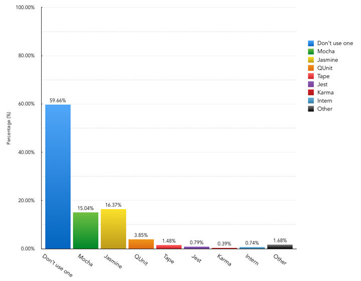

# Máster en Programación FullStack con JavaScript y Node.js
### JS, Node.js, Frontend, Backend, Firebase, Express, Patrones, HTML5_APIs, Asincronía, Websockets, Testing

## Clase 91

## Fun Fun Function!

[](https://www.youtube.com/channel/UCO1cgjhGzsSYb1rsB4bFe4Q/search?query=testing)


### Testing en la práctica



**Las claves**
- Código que verifica el funcionamiento de otro código.
- Deben poder realizarse de manera automática.
- Cubrir mayor cantidad de código posible.
- Independientes entre si.
- Capaces de ejercutarse infinidad de veces.
- Pueden agruparse en Test Suites.
- Uso de colores y mensajes claros.
- [A guide to unit testing in JavaScript](https://github.com/mawrkus/js-unit-testing-guide)

**Ejemplo: Versión Browser**
```javascript
// Función
function sumar (p1, p2){
  return p1 + p2;
}

// Test
function testSumar(){
  if (sumar(1, 2) !== 3) {
    document.write('<p style="color: red;">sumar(1, 2) ERROR - No devuelve 3</\p>');
  } else {
    document.write('<p style="color: green;">sumar(1, 2) OK</p>');
  }

  if (sumar("2", 2) !== 4) {
    document.write('<p style="color: red;">sumar("2", 2) ERROR - No devuelve 4</p>');
  } else {
    document.write('<p style="color: green;">sumar("2", 2) OK</p>');
  }
}
```

**Ejemplo: Versión Node.js**
```javascript
const chalk = require('chalk');
const log = console.log;

// Función
function sumar (p1, p2){
  return p1 + p2;
}

// Test
function trueAssert(msg) {
    log(chalk.bgGreen.white(msg))
}

function falseAssert(msg) {
    log(chalk.bgRed.white(msg))
}

function testSumar(){
  if (sumar(1, 2) !== 3) {
    falseAssert("sumar(1, 2) ERROR")
  } else {
    trueAssert("sumar(1, 2) OK")
  }

  if (sumar("2", 2) !== 4) {
    falseAssert('sumar("2", 2) ERROR - No devuelve 4')
  } else {
    trueAssert('sumar("2", 2) OK')
  }
}

testSumar();
```


### Usando `console.assert`


```javascript
const controlador = false;
console.assert(controlador, "\"controlador\" es igual a \"false\"");
```

### Assert Nodejs


```javascript
const assert = require('assert');

assert.equal(1, 1);     // OK, 1 == 1
assert.equal(1, '1');   // OK, 1 == '1'
assert.equal(1, 2);     // AssertionError: 1 == 2

assert.equal({ a: { b: 1 } }, { a: { b: 1 } }); 
// AssertionError: { a: { b: 1 } } == { a: { b: 1 } }
```

**[Assertion Testing](https://nodejs.org/api/assert.html)**
- [Strict mode](https://nodejs.org/api/assert.html#assert_strict_mode)
- [`assert(value[, message])`](https://nodejs.org/api/assert.html#assert_assert_value_message)
- [`assert.deepEqual(actual, expected[, message])`](https://nodejs.org/api/assert.html#assert_assert_deepequal_actual_expected_message)
- [`assert.deepStrictEqual(actual, expected[, message])`](https://nodejs.org/api/assert.html#assert_assert_deepstrictequal_actual_expected_message)
- [`assert.deepStrictEqual`: Comparison details](https://nodejs.org/api/assert.html#assert_comparison_details)
- [`assert.doesNotReject(block[, error][, message])`](https://nodejs.org/api/assert.html#assert_assert_doesnotreject_block_error_message)
- [`assert.doesNotThrow(block[, error][, message])`](https://nodejs.org/api/assert.html#assert_assert_doesnotthrow_block_error_message)
- [`assert.equal(actual, expected[, message])`](https://nodejs.org/api/assert.html#assert_assert_equal_actual_expected_message)
- [`assert.fail([message])`](https://nodejs.org/api/assert.html#assert_assert_fail_message)
- [`assert.ifError(value)`](https://nodejs.org/api/assert.html#assert_assert_iferror_value)
- [`assert.notDeepEqual(actual, expected[, message])`](https://nodejs.org/api/assert.html#assert_assert_notdeepequal_actual_expected_message)
- [`assert.notDeepStrictEqual(actual, expected[, message])`](https://nodejs.org/api/assert.html#assert_assert_notdeepstrictequal_actual_expected_message)
- [`assert.notEqual(actual, expected[, message])`](https://nodejs.org/api/assert.html#assert_assert_notequal_actual_expected_message)
- [`assert.notStrictEqual(actual, expected[, message])`](https://nodejs.org/api/assert.html#assert_assert_notstrictequal_actual_expected_message)
- [`assert.ok(value[, message])`](https://nodejs.org/api/assert.html#assert_assert_ok_value_message)
- [`assert.rejects(block[, error][, message])`](https://nodejs.org/api/assert.html#assert_assert_rejects_block_error_message)
- [`assert.strictEqual(actual, expected[, message])`](https://nodejs.org/api/assert.html#assert_assert_strictequal_actual_expected_message)
- [`assert.throws(block[, error][, message])`](https://nodejs.org/api/assert.html#assert_assert_throws_block_error_message)


### Frameworks de testing

**BDD/TDD**
- [MochaJS](http://mochajs.org/) - ☕️ simple, flexible, fun javascript test framework for node.js & the browser 
- [Jasmine](http://jasmine.github.io/) - Simple JavaScript testing framework for browsers and node.js
- [Intern](https://theintern.github.io/) - Intern. Software testing for humans.
- [Chai](http://chaijs.com/)- BDD / TDD assertion framework for node.js and the browser that can be paired with any testing framework.
- [Ava](https://github.com/avajs/ava) - 🚀 Futuristic JavaScript test runner

**BDD**
- [CucumberJS](https://github.com/cucumber/cucumber-js) - Cucumber for JavaScript 
- [Unexpected](http://unexpected.js.org/) - The extensible BDD assertion toolkit


### Test Runners
- [Karma](https://github.com/karma-runner/karma) - Spectacular Test Runner for JavaScript 
- [Jest](https://facebook.github.io/jest/) - 🃏 Delightful JavaScript Testing.
- [GlaceJS](https://glacejs.github.io/glace-core) - glace-core is a quick-start functional & unit testing framework based on mocha and extensible with plugins (how plugins work).
- [Apickli](https://github.com/apickli/apickli) - apickl. REST API integration testing framework based on cucumber.js


### Spies, Stubs & Mock frameworks
- [Sinon.JS](http://sinonjs.org/) - Test spies, stubs and mocks for JavaScript.
- [JSMockito](http://jsmockito.org/) - Javascript mocking framework inspired by the awesome mockito
- [Apimocker](https://github.com/gstroup/apimocker) - node.js module to run a simple http server for mock service responses.
- [Rewire](https://github.com/jhnns/rewire) - Easy monkey-patching for node.js unit tests
- [Enzyme](http://airbnb.io/enzyme/docs/api/) - JavaScript Testing utilities for React
- [Testdouble](https://github.com/testdouble/testdouble.js) - A minimal test double library for TDD with JavaScript

### Code analysis
- [ESLint](http://eslint.org/) - A fully pluggable tool for identifying and reporting on patterns in JavaScript 
- [JsHint](http://jshint.com/) - JSHint is a tool that helps to detect errors and potential problems in your JavaScript code
- [JsLint](http://www.jslint.com/) - The JavaScript Code Quality Tool


### Performance & stress & load
- [k6](https://github.com/loadimpact/k6) - A modern load testing tool, using Go and JavaScript 
- [Artillery](https://artillery.io/) - Flexible and powerful toolkit for load and functional testing. HTTP, Socket.io, WebSockets, Kinesis, HLS. Make your systems indestructible! 👩‍💻 🏰 
- [LoadComplete](https://smartbear.com/product/loadcomplete/overview/) - Load Testing Tool for Websites and Web Apps


### Security checking
- [OWASP Glue](https://github.com/OWASP/glue) - Application Security Automation
- [OWASP ZAP](https://github.com/zaproxy/zaproxy) - The OWASP ZAP core project
- [BeEF](http://beefproject.com/) - Manipulate the browser exploiting any XSS vulns you find

### Reporting

- [ReportPortal.io](http://reportportal.io/) - AI-powered Test Automation Dashboard
- [Istanbul](https://github.com/gotwarlost/istanbul) - Yet another JS code coverage tool that computes statement, line, function and branch coverage with module loader hooks to transparently add coverage when running tests. Supports all JS coverage use cases including unit tests, server side functional tests and browser tests. Built for scale.
- [Blanket](http://blanketjs.org/) - blanket.js is a simple code coverage library for javascript. Designed to be easy to install and use, for both browser and nodejs.
- [Mochawesome](https://github.com/adamgruber/mochawesome) - A Gorgeous HTML/CSS Reporter for Mocha.js 
- [allure](http://allure.qatools.ru/) - There are lots of cool testing frameworks for different programming languages. Unfortunately only a few of them can provide good representation of test execution output. The Yandex testing team is working on Allure - an open-source framework designed to create test execution reports that are clear to everyone in the team.


### Qunit


**Las Claves**
- Facil y sencillo
- Ideal para empezar
- No contiene muchos plugins
- Originalmente creado para testear JQuery


**Implementacion en browser**

fichero `index.html`
```html
<!DOCTYPE html>
<html>
<head>
  <meta charset="utf-8">
  <meta name="viewport" content="width=device-width">
  <title>QUnit Example</title>
  <link rel="stylesheet" href="https://code.jquery.com/qunit/qunit-2.6.2.css">
</head>
<body>
  <div id="qunit"></div>
  <div id="qunit-fixture"></div>
  <script src="https://code.jquery.com/qunit/qunit-2.6.2.js"></script>
  <script src="tests.js"></script>
</body>
</html>
```

fichero `test.js`
```javascript
QUnit.test( "hello test", function( assert ) {
  assert.ok( 1 == "1", "Passed!" );
});
```

**Implementación en Nodejs**

`npm install --save-dev qunit`

**Ejemplo**
```javascript
// Función
function sumar (p1, p2){
return p1 + p2;
}

// Test
test("test de la funcion sumar(p1, p2)", function() {
equal(sumar( 1, 2), 3, "1 + 2 = 3" );
notEqual(sumar( "2", 2), "4", " 2(cadena) + 2 != 4(cadena) ");
});
```

**Documentación**
- [Web Oficial](https://qunitjs.com/)
- [Documentación](https://api.qunitjs.com/)
- [Introduction to Unit Testing](http://qunitjs.com/intro/)
- [QUnit en Github](https://github.com/qunitjs/qunitjs.com)
- [El equipo](https://qunitjs.com/about/#qunit-team)
- [@qunitjs en Twitter](https://twitter.com/qunitjs)
- [QUnit Forum](https://forum.jquery.com/qunit-and-testing)
- [QUnit Cookbook](http://qunitjs.com/cookbook/)


**[API - Main methods](https://api.qunitjs.com/QUnit/)**
- [`QUnit.module( name [, hooks] [, nested ] )`](https://api.qunitjs.com/QUnit/module)
- [`QUnit.only( name, callback )`](https://api.qunitjs.com/QUnit/only)
- [`QUnit.skip( name )`](https://api.qunitjs.com/QUnit/skip)
- [`QUnit.start()`](https://api.qunitjs.com/QUnit/start)
- [`QUnit.test( name, callback )`](https://api.qunitjs.com/QUnit/test)
- [`QUnit.todo( name, callback )`](https://api.qunitjs.com/QUnit/todo)


**[API - Assertions](https://api.qunitjs.com/assert/)**
- [`async( [ acceptCallCount = 1 ] )`](https://api.qunitjs.com/assert/async)
- [`deepEqual( actual, expected [, message ] )`](https://api.qunitjs.com/assert/deepEqual)
- [`equal( actual, expected [, message ] )`](https://api.qunitjs.com/assert/equal)
- [`expect( amount )`](https://api.qunitjs.com/assert/expect)
- [`notDeepEqual( actual, expected [, message ] )`](https://api.qunitjs.com/assert/notDeepEqual)
- [`notEqual( actual, expected [, message ] )`](https://api.qunitjs.com/assert/notEqual)
- [`notOk( state [, message ] )`](https://api.qunitjs.com/assert/notOk)
- [`notPropEqual( actual, expected [, message ] )`](https://api.qunitjs.com/assert/notPropEqual)
- [`notStrictEqual( actual, expected [, message ] )`](https://api.qunitjs.com/assert/notStrictEqual)
- [`ok( state [, message ] )`](https://api.qunitjs.com/assert/ok)
- [`propEqual( actual, expected [, message ] )`](https://api.qunitjs.com/assert/propEqual)
- [`pushResult( data: { result, actual, expected, message } )`](https://api.qunitjs.com/assert/pushResult)
- [`rejects( promise[, expectedMatcher][, message ] )`](https://api.qunitjs.com/assert/rejects)
- [`step( [ message ] )`](https://api.qunitjs.com/assert/step)
- [`strictEqual( actual, expected [, message ] )`](https://api.qunitjs.com/assert/strictEqual)
- [`throws( blockFn[, expectedMatcher][, message ] )`](https://api.qunitjs.com/assert/throws)
- [`timeout( duration )`](https://api.qunitjs.com/assert/timeout)
- [`verifySteps( steps [, message ] )`](https://api.qunitjs.com/assert/verifySteps)


**[API - Config](https://api.qunitjs.com/config/)**
- [`QUnit.assert`](https://api.qunitjs.com/config/QUnit.assert)
- [`QUnit.config`](https://api.qunitjs.com/config/QUnit.config)
- [`QUnit.dump.parse( data )`](https://api.qunitjs.com/config/QUnit.dump.parse)
- [`QUnit.extend( target, mixin )`](https://api.qunitjs.com/config/QUnit.extend)
- [`QUnit.push( result, actual, expected, message )`](https://api.qunitjs.com/config/QUnit.push)
- [`QUnit.stack( [ offset = 0 ] )`](https://api.qunitjs.com/config/QUnit.stack)

**[API - Callbacks](https://api.qunitjs.com/callbacks/)**
- [`QUnit.begin( callback )`](https://api.qunitjs.com/callbacks/QUnit.begin)
- [`QUnit.done( callback )`](https://api.qunitjs.com/callbacks/QUnit.done)
- [`QUnit.log( callback )`](https://api.qunitjs.com/callbacks/QUnit.log)
- [`QUnit.moduleDone( callback )`](https://api.qunitjs.com/callbacks/QUnit.moduleDone)
- [`QUnit.moduleStart( callback )`](https://api.qunitjs.com/callbacks/QUnit.moduleStart)
- [`QUnit.on( eventName, callback )`](https://api.qunitjs.com/callbacks/QUnit.on)
- [`QUnit.testDone( callback )`](https://api.qunitjs.com/callbacks/QUnit.testDone)
- [`QUnit.testStart( callback )`](https://api.qunitjs.com/callbacks/QUnit.testStart)

**[API - Async Control](https://api.qunitjs.com/async)**
- [`async( [ acceptCallCount = 1 ] )`](https://api.qunitjs.com/assert/async)
- [`QUnit.start()`](https://api.qunitjs.com/QUnit/start)
- [`QUnit.test( name, callback )`](https://api.qunitjs.com/QUnit/test)
- [`timeout( duration )`](https://api.qunitjs.com/assert/timeout)

### Mocha & Chai


**Las claves**
- Mocha es el framework de testing isomórfico
- Chai es la librería de aserciones que ofrece [tres interfaces (assert, expect y shpuld)](https://stackoverflow.com/a/52299306)

**Las interfaces de Chai**
```javascript
//Assert: 
assert.typeOf( cadena, 'string', 'cadena es un string' );

//Expect: 
expect( cadena ).to.be.a( 'string' );

//Should: 
cadena.should.be.a( 'string' );
```

**Chai plugins**
- [chai-semver](https://www.chaijs.com/plugins/chai-semver/) - Semver plugin for Chai
- [chai-fs](https://www.chaijs.com/plugins/chai-fs/) - Chai assertion plugin for the Node.js filesystem API. Uses `path` and synchronous `fs` to assert files and directories.
- [Chai Events](https://www.chaijs.com/plugins/chai-events/) - Make assertions about event emitters.
- [Chai HTTP](https://www.chaijs.com/plugins/chai-http/) - HTTP integration testing with Chai assertions.
- [chai-spy](https://www.chaijs.com/plugins/chai-spy/) - :mag_right: Spies for the Chai Assertion Library
- [Chai Assertions for RxJS Observables](https://www.chaijs.com/plugins/chai-rx/) - ChaiRx extends Chai with a simple utility method `emit` for testing emits from an RxJS Observable stream using the `Rx.TestScheduler`.
- [chai-moment-string](https://www.chaijs.com/plugins/chai-moment-string/) - chai plugin for validating a string with an expected moment format
- [chai-fireproof](https://www.chaijs.com/plugins/chai-fireproof/) - Chai assertions and helpers for Firebase and Fireproof.
- [chai-eventemitter](https://www.chaijs.com/plugins/chai-eventemitter/) - This is a plugin for chai to simplify the testing of EventEmitter.
- [Chai Spies](https://www.chaijs.com/plugins/chai-spies/) - It provides the most basic function spy ability and tests.
- [Sinon.JS Assertions for Chai](https://www.chaijs.com/plugins/sinon-chai/) - Sinon–Chai provides a set of custom assertions for using the Sinon.JS spy, stub, and mocking framework with the Chai assertion library. You get all the benefits of Chai with all the powerful tools of Sinon.JS.
- [chai-url](https://www.chaijs.com/plugins/chai-url/) - A chai assertion plugin for working with urls
- [chai-dom](https://www.chaijs.com/plugins/chai-dom/) - chai-dom is an extension to the chai assertion library that provides a set of assertions when working with the DOM (specifically HTMLElement and NodeList)
- [In-Order Sinon-Chai Assertions](https://www.chaijs.com/plugins/sinon-chai-in-order/) - Sinon-Chai provides Chai assertions for Sinon.JS. Unfortunately, it does not deal with making sure a spy was called multiple time in a specific order. 


**Ejemplo**
```javascript
// Función
function sumar (p1, p2){
return p1 + p2;
}

// Test
mocha.setup('bdd');
const expect = chai.expect;
const should = chai.should();
describe("Test de la funcion sumar(p1, p2)", () => {

it('1 + 2 = 3', () => {
  expect(sumar( 1, 2)).to.equal(3);
});

it('\"2\" + 2 != \"4\"', () => {
  expect(sumar( "2", 2)).not.equal("4");
});

});

mocha.run();
```

**Documentación**
- [Chaijs](https://www.chaijs.com/api/)
  - [guide](https://www.chaijs.com/guide/)
    - [Installation](https://www.chaijs.com/guide/installation/)
    - [Assertion Styles](https://www.chaijs.com/guide/styles/)
    - [Core Plugin Concepts](https://www.chaijs.com/guide/plugins/)
    - [Building a Helper](https://www.chaijs.com/guide/helpers/)
    - [Resources](https://www.chaijs.com/guide/resources/)
  - [Api](https://www.chaijs.com/api/)
  - [Expect/Should (BDD)](https://www.chaijs.com/api/bdd/)
  - [Assert (TDD)](https://www.chaijs.com/api/assert/)
  - [Plugin Utilities](https://www.chaijs.com/api/plugins/)
  - [Online Test Suite](https://www.chaijs.com/api/test/?grep=assert)
- [Mochajs](https://mochajs.org/)
  - [Features](https://mochajs.org/#features)
  - [Guía](https://mochajs.org/#table-of-contents)
  - [Github](https://github.com/mochajs/mocha)
  - [#mochajs en Twitter](https://twitter.com/hashtag/mochajs?lang=es)

### Sinon


**Documentación**
- [Web oficial](https://sinonjs.org)
- [Documentación](https://sinonjs.org/releases/v6.3.4/)
- [Releases](https://sinonjs.org/releases/)
- [Guías de Migración](https://sinonjs.org/guides/)
- [How to](https://sinonjs.org/how-to/)

**Ejemplo**
```javascript
// Función
function getTodos(listId, callback) {
    jQuery.ajax({
        url: '/todo/' + listId + '/items',
        success: function (data) {
            // Node-style CPS: callback(err, data)
            callback(null, data);
        }
    });
}

// Testing
after(function () {
    // When the test either fails or passes, restore the original
    // jQuery ajax function (Sinon.JS also provides tools to help
    // test frameworks automate clean-up like this)
    jQuery.ajax.restore();
});

it('makes a GET request for todo items', function () {
    sinon.replace(jQuery, 'ajax', sinon.fake());
    getTodos(42, sinon.fake());

    assert(jQuery.ajax.calledWithMatch({ url: '/todo/42/items' }));
});
```

### Aprendiendo testing en JS y Node


**Recursos**
- [A guide to unit testing in JavaScript](https://github.com/mawrkus/js-unit-testing-guide)
- [How Netflix does A/B Testing](https://uxdesign.cc/how-netflix-does-a-b-testing-87df9f9bf57c)
- [An Overview of JavaScript Testing in 2018](https://medium.com/welldone-software/an-overview-of-javascript-testing-in-2018-f68950900bc3)
- [I Spent $30,000 Testing Different Blog Designs — Here’s What I Found](https://medium.com/marketing-and-entrepreneurship/i-spent-30-000-testing-different-blog-designs-heres-what-i-found-8952bf057b8f)
- [An Overview of JavaScript Testing in 2017](https://medium.com/powtoon-engineering/a-complete-guide-to-testing-javascript-in-2017-a217b4cd5a2a)
- [Airbnb Guerilla Usability Testing](https://medium.com/interactive-mind/airbnb-guerilla-usability-testing-548b4676d06c)
- [A crash course on testing with Node.js](https://hackernoon.com/a-crash-course-on-testing-with-node-js-6c7428d3da02)
- [The easy way to start automatically testing your website](https://medium.freecodecamp.org/how-to-easily-start-automatically-testing-your-website-8629ea8df04a)
- [Why End-to-End Testing is Important for Your Team](https://medium.freecodecamp.org/why-end-to-end-testing-is-important-for-your-team-cb7eb0ec1504)
- [JS Vanilla Test Code Coverage](https://medium.com/@WebReflection/js-vanilla-test-code-coverage-7b7ba3740776)
- [Vanilla JS Testing — Part II](https://medium.com/@WebReflection/vanilla-js-testing-part-ii-63b9d736121)
- [AVA, low-config testing for JavaScript](https://blog.hellojs.org/ava-low-config-testing-for-javascript-71bd2d958745)
- [Revisiting Node.js Testing: Part 1](https://codeburst.io/revisiting-node-js-testing-part-1-84c33bb4d711)
- [How to test JavaScript with Mocha — The Basics](https://codeburst.io/how-to-test-javascript-with-mocha-the-basics-80132324752e)
- [Node.js End-to-End Testing with Nightwatch.js](https://hackernoon.com/node-js-end-to-end-testing-with-nightwatch-js-1c11163d442c)
- [How to automate tests and deployments of Node.js apps](https://medium.com/@BuddyWorks/how-to-automate-tests-and-deployments-of-node-js-apps-76f9cfdc6937)
- [Github | TheJambo/awesome-testing](https://github.com/TheJambo/awesome-testing)
- [Github | atinfo/awesome-test-automation](https://github.com/atinfo/awesome-test-automation/blob/master/javascript-test-automation.md)
- [Github | ligurio/awesome-software-quality](https://github.com/ligurio/awesome-software-quality)
- [7 Things Awesome Testers do That Don't Look Like Testing](https://www.linkedin.com/pulse/7-things-awesome-testers-do-dont-look-like-testing-simon-knight/)
- [5 Awesome Mobile Application Testing Tools & Platforms for Testers](https://www.cigniti.com/blog/5-awesome-mobile-application-testing-tools-platforms-testers/)
- [Software Testing for Continuous Delivery](https://www.atlassian.com/software-testing)
- [API Unit Testing with Node JS](https://medium.com/@scottietom/api-unit-testing-with-node-js-b87582bdf9c6)
- [Node Hero - Node.js Unit Testing Tutorial](https://blog.risingstack.com/node-hero-node-js-unit-testing-tutorial/)
- [Unit Testing and TDD in Node.js – Part 1](https://www.codementor.io/davidtang/unit-testing-and-tdd-in-node-js-part-1-8t714s877)
- [JavaScript — Unit Testing using Mocha and Chai](https://codeburst.io/javascript-unit-testing-using-mocha-and-chai-1d97d9f18e71)
- [Lo mejor y peor de Mocha y de los unit tests en JavaScript](https://solidgeargroup.com/mocha-unit-tests-en-javascript?lang=es)
- [How to mock a dependency in a Node.js, and why you should do it.](https://itnext.io/how-to-mock-dependency-in-a-node-js-and-why-2ad4386f6587)
- [How to mock requests for unit testing in Node](https://medium.freecodecamp.org/how-to-mock-requests-for-unit-testing-in-node-bb5d7865814a)
- [Using Jasmine to Test Node.js Applications](https://blog.codeship.com/jasmine-node-js-application-testing-tutorial/)
- [How to correctly unit test Express server](https://glebbahmutov.com/blog/how-to-correctly-unit-test-express-server/)
- [Node.js Unit Testing Tutorial with Jasmine](https://www.guru99.com/node-js-testing-jasmine.html)
- [Testing Node.js with Mocha and Chai](http://mherman.org/blog/2015/09/10/testing-node-js-with-mocha-and-chai/)
- [Getting Started with Node.js and Mocha](https://semaphoreci.com/community/tutorials/getting-started-with-node-js-and-mocha)
- [Github | unicodeveloper/awesome-tdd](https://github.com/unicodeveloper/awesome-tdd)
- [8 Reasons Why Unit Tests are Awesome](http://scottlobdell.me/2014/06/8-reasons-unit-tests-awesome/)
- [The No. 1 unit testing best practice: Stop doing it](https://techbeacon.com/1-unit-testing-best-practice-stop-doing-it)
- [Unit Tests, How to Write Testable Code and Why it Matters](https://www.toptal.com/qa/how-to-write-testable-code-and-why-it-matters)
